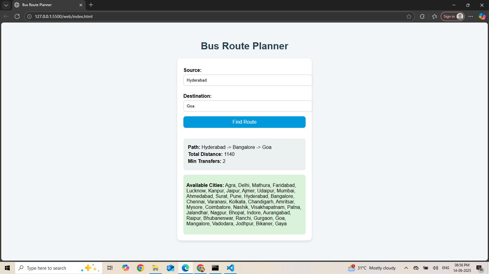

# Bus Route Optimization

A C++ & Python project to find the **shortest bus routes** between cities with minimum transfers.  
The project provides a **web interface** where users can select source and destination cities to get the shortest path, total distance, and minimum transfers.

---

## Features

- Load city routes from a CSV file.
- Calculate the shortest path using **Dijkstra's algorithm**.
- Compute **minimum transfers** using **BFS**.
- Web interface using **Flask** and HTML/JS.
- Shows all available cities to help users input correct source/destination.
- Can be extended to integrate with a React frontend.

---

## Dataset

The routes are stored in a CSV file `BusRoutes.csv` with the following format:

Source,Destination,Distance
Agra,Delhi,240
Delhi,Agra,240
Agra,Mathura,60
...


You can expand the dataset with additional cities and intermediate routes to make the shortest path algorithm more interesting.

---

## Running the Project

### 1. Compile the C++ executable

```bash
g++ -std=c++17 BusRoutePlanner.cpp main.cpp -o bus_planner
```

### 2. Run Flask server

Make sure Python 3.x is installed along with Flask and Flask-CORS:
```bash
pip install flask flask-cors
python app.py
```
The web app will run at: http://127.0.0.1:5000

### 3. Web Interface

Open index.html in your browser or serve it via Flask.
Enter source and destination cities to get:

- Shortest Path

- Total Distance

- Minimum Transfers

## Example Output




###Project Structure
```bash
BusRouteOptimization/
├── BusRoutePlanner.cpp
├── BusRoutePlanner.h
├── main.cpp
├── app.py
├── index.html
├── BusRoutes.csv
├── output.png
└── README.md
```


